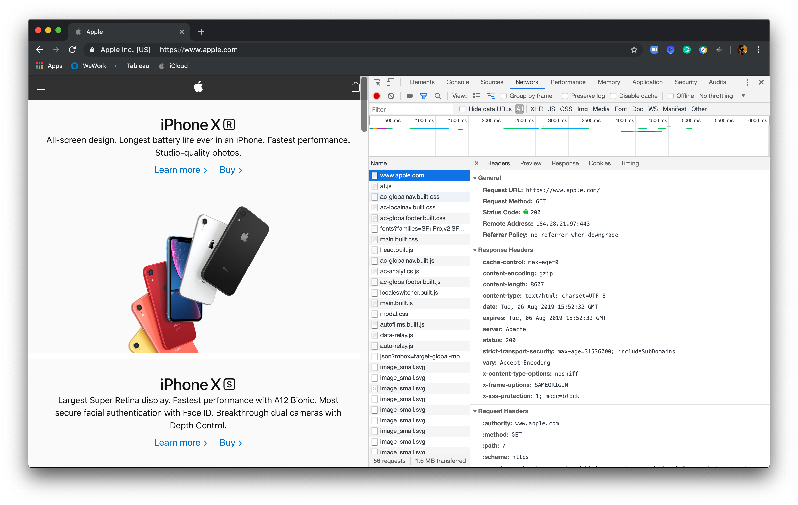
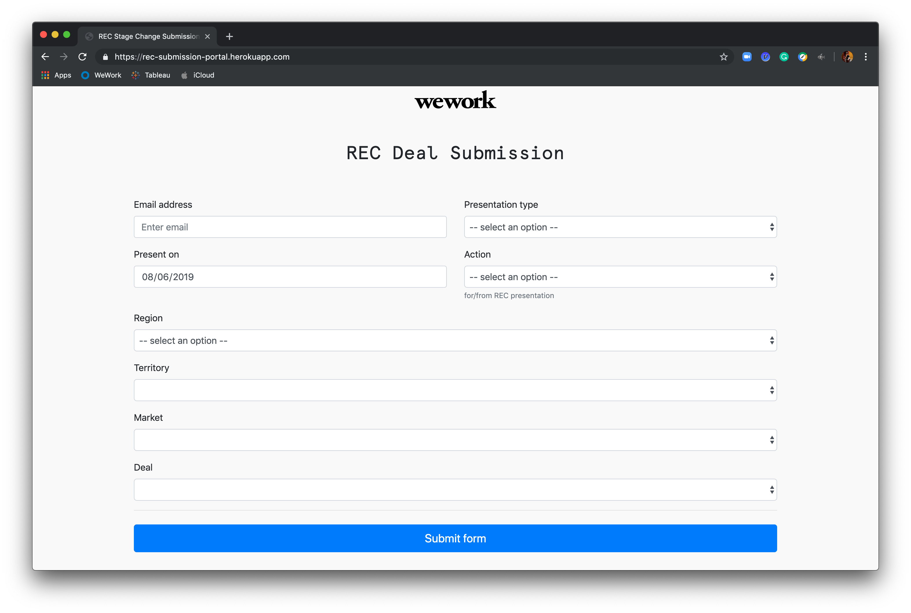
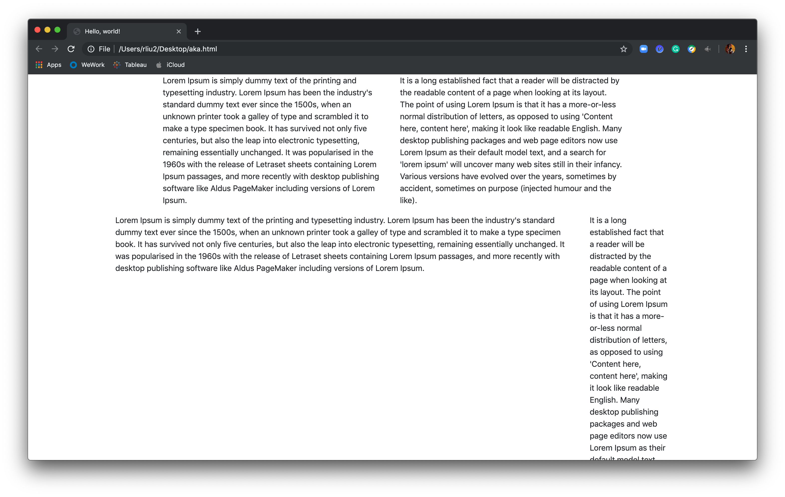

# Web Dev Handbook
##### Lex Liu
###### 2019 Summer Internship
###### Real Estate Data + Insights

## WEB 101: Intro to Web Dev
### Setting up your machine
#### Clone EMEA REC Submission Portal Repo
```shell
git clone git@github.com:WeConnect/EMEA_REC.git
cd EMEA_REC
```

#### Python
I am using `Python==3.7.3`, but I think this script works for all versions of `Python 3`. Since all of us have Python installed, I don't need to write a 10-page essay on Python installation right?

#### Python dependencies
I have compiled necessary packages into `requirements.txt`, so you can install all dependencies with this one liner.
```shell
pip install -r requirements.txt
```

#### HTML + JavaScript
As long as you have Chrome or a browser that's not IE, you are good to go.

### Back End
#### Config back-end with `gunicorn` + `Flask`
In the previous version, we set up the back-end by running `Flask` directly, and it requires too much overhead and knowledge about `Flask`. With help of WSGI (Web Server Gateway Interface) `gunicorn`, back-end set-up is as easy as `gunicorn <filename>:app`. For my projects, use these:

```shell
# development mode, server restarts when file app.py changes
gunicorn app:app --reload

# production mode
gunicorn app:app
```
To bind to a specific port, use flag `-b`. The default value is `:8000`. Port `:8080` and `:8090` are famous alternatives. Ports`:0 - :1023` are reserved, but anything in `:1024 - :65535` should be good. Something good to know is that *Jupyter Notebook* runs on `:8888`, make sure don't collide with it. For more details please visit [here](https://en.wikipedia.org/wiki/List_of_TCP_and_UDP_port_numbers).
```shell
gunicorn app:app -b :8080
```

#### Config back-end with `Flask` alone
I know that I onboard you to the one liner back-end, but by using `Flask` alone, it cuts unnecessary details to run a public server on our very own machine, such as proxies or loggers.

 - Production mode
 ```shell
 export FLASK_APP=app.py
 flask run
 ```

 - Development mode
 ```shell
 export FLASK_APP=app.py
 export FLASK_ENV=development
 flask run
 ```

 - Externally visible server
 ```shell
 export FLASK_APP=app.py
 export FLASK_ENV=development <optional>
 flask run --host=0.0.0.0
 ```

`Flask` runs on port `:5000`.
### Now that I have everything, how do I get started?
#### Visit from the same machine (usually for development and testing purpose)
Open Chrome and navigate to `http://localhost:<port number>` or `http://127.0.0.1:<port number>`. You can find more information about `localhost` [here](https://en.wikipedia.org/wiki/Reserved_IP_addresses).
#### Visit from another machine
This requires your back end to be externally visible. Open Chrome and navigate to `http://<IP Address of Back End>:<port number>`. Use this shell command to find you IP address. ~~You can go to Settings > Network.~~ (deleted because we want to be fancy and live with the coder stereotype)
```shell
ifconfig | grep "inet " | grep -v 127.0.0.1 | cut -d\  -f2
```
If multiple IP addresses pop up, go with `10.x.x.x`, which is your WeWork Corp network IP address, so as long as people are connected to WeWork Corp, they can visit your site.

## WEB 201: How to Web Dev
### Front End
Most of us have experience with HTML and CSS, so I am not going to spend too much time on that. HTML stands for **Hyper Text Mark-up Language** and defines contents to present on a webpage. CSS stands for **Cascading Style Sheets** and defines visual effects and behaviors of your contents. HTML + CSS are good enough for a static webpage, but with the help of JavaScript, you are empowered to design a dynamic page by fetching resources from other sites, listen to user actions and make changes correspondingly, and most importantly define logic!
#### How exactly should I interact with my webpage using JavaScript?
Here I introduce you to vanilla JavaScript. There are tons of popular frameworks/extensions of JavaScript, for example `Vue.JS`, `React.JS` and `Augular.JS`, but their learning curve are too steep and they don't add any functionalities...

Create a new file and name it `index.html`. Fill it with these:
```html
<html>
    <body>
        <h1 id="target" class="main">Hello, this is REDI.</h1>
        <script>
            document.getElementById("target")
                .addEventListener("mouseover",
                    () => {
                        document.getElementById("target").innerHTML =
                            "Cursor is here";
                    });
        </script>
    </body>
</html>
```
*JavaScript lives in script tags. Following are JavaScript.*

Now, open this file in Chrome and move your mouse on the text. The text changes! Isn't that amazing!

Here I used arrow function, it is a short hand notation. Learn more about arrow function [here](https://www.sitepoint.com/es6-arrow-functions-new-fat-concise-syntax-javascript/). Basically, you can rewrite all functions using arrows:
```JavaScript
// Input: x, y
// Output: x + y
function(x, y) {
    return x + y;
}

(x, y) => {return x + y}

// You can drop braces and keyword return
(x, y) => x + y;
```

#### Document Object Model (DOM)
DOM is an interface for HTML, like the example above `document.getElementById`, and is a way to retrieve elements from the webpage. Variable `document` refers to the webpage. TFAE:
```JavaScript
document.getElementById("target");
document.getElementsByClassName("main")[0];
document.getElementsByTagName("h1")[0];
```
If you are familiar with CSS selectors, you can also use them here:
```JavaScript
document.querySelector("#target");
document.querySelector(".main")
document.querySelector("h1");
```
XPath also works:
```JavaScript
document.querySelector("html > body > h1");
```

#### Change attributes
`JSON` is short for **JavaScript Object Notation**, and all elements are returned as an object through DOM. Therefore, you should be able to change them like how you manipulate with other `JSON` objects.
```JavaScript
document.getElementById("target").innerHTML = `
    Hello, <span style="color:Blue;">Stranger</span>`;
```
There are certain amount of attributes that you have to use `.setAttribute` to modify.
```JavaScript
// Change element ID
document.getElementById("target").setAttribute("id", "newID");
```

### Back End
#### Why do I have to write back end code?
As of 2019, we are no longer sharing raw files, but rather we share a URL. A URL will point you to a server and the response you get from there is defined by its back end logic.

There are lots of back end frameworks and `Flask` is one of them. I believe that you have heard of the legendary `PHP`, **the back end language** 10 years ago. Things change quite a lot for the past 10 years and `Node.JS` has become the go-to language.

#### Folder structure
Create a project folder like this: (we can reuse `index.html` from above)
```
WEB 201
+-- templates
|   +-- index.html
|   +-- anotherindex.html
+-- app.py
```
Use these for `anotherindex.html`
```HTML
<html>
    <body>
        <h1>Yo, stranger! What's up!</h1>
    </body>
</html>
```
#### Code up our first ever server
Put these lines into `app.py`.
```Python
import flask
from flask import render_template

# initialize flask instance
app = flask.Flask(__name__)

# define logic
@app.route('/')
def render_index():
    return render_template('index.html')

@app.route('/foobar/')
def anotherindex():
    return render_template('anotherindex.html')
```
Let's push the start button!
```Shell
export FLASK_APP=app.py
flask run
```
Navigate to `http://localhost:5000` in your browser and you should see your `index.html` served there. Navigate to `http://localhost:5000/foobar/`, `anotherindex.html` is rendered.

#### Further down into `render_template` (Optional)
You can make use of the template functionality! It's super handy when you want to incorporate logic into webpage rendering. Read more about template [here](https://flask.palletsprojects.com/en/1.1.x/quickstart/#rendering-templates).

Change `anotherindex.html` to these.
```html
<html>
    <body>
        
        <h1>Yo, {{ name }}! What's up!</h1>
        
        <h1>Yo, Stranger! Nice to meet you!</h1>
        
    </body>
</html>
```
Also, make these modification to `app.py`.
```Python
@app.route('/foobar/<name>')
def anotherindex(name=None):
    return render_template('anotherindex.html', name=name)
```
Unleash the power of template by navigating to `http://localhost:5000/foobar/` and `http://localhost:5000/foobar/<your name>`.

#### Deploy on Heroku
##### Virtual environment
If you have not installed `virtualenv`:
```Shell
pip install virtualenv
```
We need to create a virtual environment to generate a dependency file.
```Shell
# Create a new virtual environment
virtualenv env
# Activate virtualenv
source env/bin/activate
```
In here, let's install all necessary packages again. In our scenario, we are only using `Flask` and `gunicorn`.
```shell
pip install Flask
pip install gunicorn
# also pip install other packages if used in app.py
# pip install <somethingelse>
```
Zip all dependencies into `requirements.txt`.
```shell
pip freeze > requirements.txt
```
To quit out of the virtual environment:
```shell
deactivate
```

##### Tell Heroku which program we are using
If you are using `Python-3.7.3`, use these. Otherwise, replace the patch number with your local patch number. Check your local Python version `python --version`.
```shell
echo "python-3.7.3" > runtime.txt
```

##### Tell Heroku how to run your project
```shell
echo "web: gunicorn app:app" > Procfile
```

##### So far, you should have
```
WEB 201
+-- templates
|   +-- index.html
|   +-- anotherindex.html
+-- app.py
+-- Procfile
+-- runtime.txt
+-- requirements.txt
```
##### Set up Heroku locally
###### Install Heroku CLI
```shell
brew tap heroku/brew && brew install heroku
```
###### Verifying your installation
```shell
heroku --version
# heroku/7.0.0 (darwin-x64) node-v8.0.0
```
###### Login
```shell
# Open in a browser
heroku login
# OR
# Stay in terminal
heroku login -i
```

##### Push to heroku
###### Create a local `.git` if you haven't already
```shell
git init
```
###### Create a remote heroku project
```shell
heroku create
```
###### Finally, deploy on heroku
```shell
git add .
git commit -m "heroku deployment"
git push heroku master
heroku open
```

## WEB 301: Web Dev Master
### Working with `HTTP`
`HTTP` stands for **Hyper Text Transfer Protocol**. We issue a large volume of `HTTP` requests everyday. Sending Slack messages, uploading files to Google Drive and even navigating to a random website are hitting different requests. Take a look at the header of any website, it is either `http://` or an enhanced version `https://`.

#### Types of `HTTP` methods
There are 7 methods: `GET`, `POST`, `PUT`, `HEAD`, `DELETE`, `PATCH` and `OPTIONS`. Open Chrome and go to developer tools. Click on Networks tab and visit `apple.com`. The tab is soon populated. Click on any item there, and in the popped-up panel, in **Request Method** row, one of the above keywords are there!



#### `HTTP` request

#### How exactly should I issue my own request?
Our literature teacher, Ms. Smith asked us to read _The Great Gatsby_, but we are sneaky. We take turns to do the reading and share a SparkNotes to other classmates. It's your turn this time, and you decided to `GET` a SparkNotes from `https://jsonplaceholder.typicode.com/todos/1`. You learned from Annie that there is a powerful tool called `curl`, which is super cool to test APIs.
```shell
curl --get https://jsonplaceholder.typicode.com/todos/1
# Response below
{
  "userId": 1,
  "id": 1,
  "title": "delectus aut autem",
  "completed": false
}
```
Once it works, it's time to incorporate it into your project. Now, let's pull in `index.html` again, and make some changes to it.

*Both functions are __asynchronous__, meaning they run in the background and will not pause subsequent scripts.*

##### Foreign jQuery version
In order to use foreign function `$.ajax`, we have to introduce jQuery to our webpage *(line 4)*. A formatting framework I will introduce later uses jQuery, so might as well just throw that line there.

*You can run the following in your browser or [here](https://www.w3schools.com/html/tryit.asp?filename=tryhtml_default).*
```html
<html>
    <body>
        <h1 id="target" class="main">Hello, this is REDI.</h1>
        <script src="https://code.jquery.com/jquery-3.4.1.js" integrity="sha256-WpOohJOqMqqyKL9FccASB9O0KwACQJpFTUBLTYOVvVU=" crossorigin="anonymous"></script>
        <script>
            document.getElementById("target")
                .addEventListener("mouseover",
                    () => {
                        $.ajax({
                            type: "GET", // Request type
                            url: "https://jsonplaceholder.typicode.com/todos/1", // Destination
                            dataType: "JSON", // Type of response expected
                        }).done(data => {
                            document.getElementById("target").innerHTML = data.title;
                        });
                    });
        </script>
    </body>
</html>
```

##### Native JavaScript version
Using native `fetch` is truly lightweight, and it's new to `ES6`.
```html
<html>
    <body>
        <h1 id="target" class="main">Hello, this is REDI.</h1>
        <script>
            document.getElementById("target")
                .addEventListener("mouseover",
                    () => {
                        fetch("https://jsonplaceholder.typicode.com/todos/1", { // Destination
                            method: "GET" // Request type
                        }).then(response => response.json()) // Cast to JSON
                          .then(data => document.getElementById("target").innerHTML = data.title);
                    });
        </script>
    </body>
</html>
```

#### Example: `POST` _The Great Gatsby_ SparkNotes online!
You are out of your luck. You didn't find any _Gatsby_ SparkNotes, so you decided to do the reading and write up your own. You have typed your notes in a `<p>` tag, and you want to `POST` it to `https://jsonplaceholder.typicode.com/posts`.
```html
<html>
    <body>
        <p id="target" class="main">Nick Carraway, a young man from Minnesota, moves to New York in the summer of 1922 to learn about the bond business. He rents a house in the West Egg district of Long Island, a wealthy but unfashionable area populated by the new rich, a group who have made their fortunes too recently to have established social connections and who are prone to garish displays of wealth. Nick’s next-door neighbor in West Egg is a mysterious man named Jay Gatsby, who lives in a gigantic Gothic mansion and throws extravagant parties every Saturday night.</p>
        <button id="submit">Click to post</button>
        <script>
            document.getElementById("submit")
                .addEventListener("click",
                    () => {
                        fetch('https://jsonplaceholder.typicode.com/posts', {
                            method: "POST",
                            body: JSON.stringify({
                                title: "The Great Gatsby SparkNotes",
                                body: document.getElementById("target").innerText,
                                userId: 9527
                            })
                        }).then(response => alert("Now your classmates have it, so does TurnItIn!"))
                    });
        </script>
    </body>
</html>
```
*Name this file `submission.html`*.
### Resolving requests with `Flask`
Since we want to host a secret website and avoid TurnItIn checks, we need to be able to handle `HTTP` on the back end, i.e. our `Flask` server.

Navigate to `https://jsonplaceholder.typicode.com/todos/1` in your browser and compare the content with results from `curl --get https://jsonplaceholder.typicode.com/todos/1`. That is not a coincidence.
```Python
import flask
from flask import render_template

# initialize flask instance
app = flask.Flask(__name__)

# define logic
@app.route('/') # This is equivalent to @app.route('/', methods=['GET'])
def render_index():
    return render_template('index.html')

@app.route('/foobar/') # This is equivalent to @app.route('/foobar/', methods=['GET'])
def anotherindex():
    return render_template('anotherindex.html')
```
Going back to `app.py` from WEB 201, it's already capable of handling `GET`. Try `curl --get http://localhost:5000`. A raw version of `index.html` is returned. Everything you type in your browser link box is issuing a `GET` to that URL!

#### Add `POST` handler
In order to handle submissions, we need to have some sort of storage/DB. Here, I am using a minimal DB, which is a local text file `log.txt`.

This is how your project should look like.
```
WEB 301
+-- templates
|   +-- submission.html
|   +-- index.html
+-- app.py
+-- rsc
|   +-- log.txt
```
Let's put these in `app.py`.
```Python
import flask
from flask import render_template

# initialize flask instance
app = flask.Flask(__name__)

@app.route('/submission/')
def submission():
    return render_template('submission.html')

@app.route('/api/', methods=['POST'])
def post():
    # Read payload data
    request = flask.request.get_json()
    # Write to DB, here using a local txt file
    with open('./rsc/log.txt', 'w') as f:
        f.writelines([request['title'], "\n", str(request['body']), "\n", str(request['userId'])])
    return 'Success'
```
We want to have a UI for `submission.html`.
```html
<html>
    <body>
        <p>Title</p>
        <input id="title"/>
        <p>Body</p>
        <textarea id="body"></textarea>
        <p>userID</p>
        <input id="userID"/>

        <button id="submit">Click to post</button>
        <script>
            document.getElementById("submit")
                .addEventListener("click",
                    () => {
                        fetch(`${location.origin}/api/`, {
                            method: "POST",
                            body: JSON.stringify({
                                title: document.querySelector("#title").value,
                                body: document.querySelector("#body").value,
                                userId: document.querySelector("#userID").value
                            }),
                            headers: {
                                "content-Type": "application/json"
                            }
                        }).then(response => alert("Success"))
                    });
        </script>
    </body>
</html>
```
#### Introducing Bootstrap (Putting everything together)
To be honest, we don't really have a UI for `submission.html`. A submission portal could be fairly simple, but we have to make the content delivery page `index.html` fancy! Here I am introducing [Bootstrap](https://getbootstrap.com/), the most popular front-end framework! In order to use Bootstrap, we have to import dependencies. Let's begin with the starter template provided on their website.

[*Starter Template*](https://getbootstrap.com/docs/4.3/getting-started/introduction/#starter-template)
```HTML
<!doctype html>
<html lang="en">
    <head>
        <!-- Required meta tags -->
        <meta charset="utf-8">
        <meta name="viewport" content="width=device-width, initial-scale=1, shrink-to-fit=no">

        <!-- Bootstrap CSS -->
        <link rel="stylesheet" href="https://stackpath.bootstrapcdn.com/bootstrap/4.3.1/css/bootstrap.min.css" integrity="sha384-ggOyR0iXCbMQv3Xipma34MD+dH/1fQ784/j6cY/iJTQUOhcWr7x9JvoRxT2MZw1T" crossorigin="anonymous">

        <title>Hello, world!</title>
    </head>
    <body>
        <h1>Hello, world!</h1>

        <!-- Optional JavaScript -->
        <!-- jQuery first, then Popper.js, then Bootstrap JS -->
        <script src="https://code.jquery.com/jquery-3.3.1.slim.min.js" integrity="sha384-q8i/X+965DzO0rT7abK41JStQIAqVgRVzpbzo5smXKp4YfRvH+8abtTE1Pi6jizo" crossorigin="anonymous"></script>
        <script src="https://cdnjs.cloudflare.com/ajax/libs/popper.js/1.14.7/umd/popper.min.js" integrity="sha384-UO2eT0CpHqdSJQ6hJty5KVphtPhzWj9WO1clHTMGa3JDZwrnQq4sF86dIHNDz0W1" crossorigin="anonymous"></script>
        <script src="https://stackpath.bootstrapcdn.com/bootstrap/4.3.1/js/bootstrap.min.js" integrity="sha384-JjSmVgyd0p3pXB1rRibZUAYoIIy6OrQ6VrjIEaFf/nJGzIxFDsf4x0xIM+B07jRM" crossorigin="anonymous"></script>
    </body>
</html>
```

##### Grid system
Bootstrap divides a page into 12 columns. For example, you can say that I want 1 column of margins, which is exactly what I did in this. Learn more about Bootstrap grids [here](https://getbootstrap.com/docs/4.3/layout/grid/#offsetting-columns).



*Email Address* goes from Col 1 to Col 6, and *Presentation Type* goes from Col 7 to Col 10, leaving Col 0 and Col 11 blank.

###### Playing with Bootstrap
```HTML
<!doctype html>
<html lang="en">
    <head>
        <!-- Required meta tags -->
        <meta charset="utf-8">
        <meta name="viewport" content="width=device-width, initial-scale=1, shrink-to-fit=no">

        <!-- Bootstrap CSS -->
        <link rel="stylesheet" href="https://stackpath.bootstrapcdn.com/bootstrap/4.3.1/css/bootstrap.min.css" integrity="sha384-ggOyR0iXCbMQv3Xipma34MD+dH/1fQ784/j6cY/iJTQUOhcWr7x9JvoRxT2MZw1T" crossorigin="anonymous">

        <title>Hello, world!</title>
    </head>
    <body>
        <!-- Bootstrap elements have to live in a container div -->
        <div class="container">
            <!-- Tell framework that the following elements are in the same row -->
            <div class="row">
                <!-- Goes from Col 1 to Col 6 -->
                <div class="col-md-5 offset-md-1">
                    <p>Lorem Ipsum is simply dummy text of the printing and typesetting industry. Lorem Ipsum has been the industry's standard dummy text ever since the 1500s, when an unknown printer took a galley of type and scrambled it to make a type specimen book. It has survived not only five centuries, but also the leap into electronic typesetting, remaining essentially unchanged. It was popularised in the 1960s with the release of Letraset sheets containing Lorem Ipsum passages, and more recently with desktop publishing software like Aldus PageMaker including versions of Lorem Ipsum.</p>
                </div>
                <!-- Goes from Col7 to Col 10 -->
                <div class="col-md-5">
                    <p>It is a long established fact that a reader will be distracted by the readable content of a page when looking at its layout. The point of using Lorem Ipsum is that it has a more-or-less normal distribution of letters, as opposed to using 'Content here, content here', making it look like readable English. Many desktop publishing packages and web page editors now use Lorem Ipsum as their default model text, and a search for 'lorem ipsum' will uncover many web sites still in their infancy. Various versions have evolved over the years, sometimes by accident, sometimes on purpose (injected humour and the like).</p>
                </div>
            </div>
            <!-- Defines another row -->
            <div class="row">
                <!-- Goes from Col 0 to Col 9 -->
                <div class="col-md-10">
                    <p>Lorem Ipsum is simply dummy text of the printing and typesetting industry. Lorem Ipsum has been the industry's standard dummy text ever since the 1500s, when an unknown printer took a galley of type and scrambled it to make a type specimen book. It has survived not only five centuries, but also the leap into electronic typesetting, remaining essentially unchanged. It was popularised in the 1960s with the release of Letraset sheets containing Lorem Ipsum passages, and more recently with desktop publishing software like Aldus PageMaker including versions of Lorem Ipsum.</p>
                </div>
                <!-- Goes from Col 10 to Col 11 -->
                <div class="col-md-2">
                    <p>It is a long established fact that a reader will be distracted by the readable content of a page when looking at its layout. The point of using Lorem Ipsum is that it has a more-or-less normal distribution of letters, as opposed to using 'Content here, content here', making it look like readable English. Many desktop publishing packages and web page editors now use Lorem Ipsum as their default model text, and a search for 'lorem ipsum' will uncover many web sites still in their infancy. Various versions have evolved over the years, sometimes by accident, sometimes on purpose (injected humour and the like).</p>
                </div>
            </div>
        </div>
        <!-- Optional JavaScript -->
        <!-- jQuery first, then Popper.js, then Bootstrap JS -->
        <script src="https://code.jquery.com/jquery-3.3.1.slim.min.js" integrity="sha384-q8i/X+965DzO0rT7abK41JStQIAqVgRVzpbzo5smXKp4YfRvH+8abtTE1Pi6jizo" crossorigin="anonymous"></script>
        <script src="https://cdnjs.cloudflare.com/ajax/libs/popper.js/1.14.7/umd/popper.min.js" integrity="sha384-UO2eT0CpHqdSJQ6hJty5KVphtPhzWj9WO1clHTMGa3JDZwrnQq4sF86dIHNDz0W1" crossorigin="anonymous"></script>
        <script src="https://stackpath.bootstrapcdn.com/bootstrap/4.3.1/js/bootstrap.min.js" integrity="sha384-JjSmVgyd0p3pXB1rRibZUAYoIIy6OrQ6VrjIEaFf/nJGzIxFDsf4x0xIM+B07jRM" crossorigin="anonymous"></script>
    </body>
</html>
```


##### Let's wrap up our secret SparkNotes system
###### Design `index.html` using templates
```HTML
<!doctype html>
<html lang="en">
    <head>
        <!-- Required meta tags -->
        <meta charset="utf-8">
        <meta name="viewport" content="width=device-width, initial-scale=1, shrink-to-fit=no">

        <!-- Bootstrap CSS -->
        <link rel="stylesheet" href="https://stackpath.bootstrapcdn.com/bootstrap/4.3.1/css/bootstrap.min.css" integrity="sha384-ggOyR0iXCbMQv3Xipma34MD+dH/1fQ784/j6cY/iJTQUOhcWr7x9JvoRxT2MZw1T" crossorigin="anonymous">

        <title>Hello, world!</title>
    </head>
    <body>
        <!-- Bootstrap elements have to live in a container div -->
        <div class="container">
            <!-- Tell framework that the following elements are in the same row -->
            <div class="row">
                <!-- Goes from Col 1 to Col 6 -->
                <div class="col-md-5 offset-md-1">
                    <p>userId<br/>{{userId}}</p>
                </div>
                <!-- Goes from Col7 to Col 10 -->
                <div class="col-md-5">
                    <p>title<br/>{{title}}</p>
                </div>
            </div>
            <!-- Defines another row -->
            <div class="row">
                <!-- Goes from Col 2 to Col 9 -->
                <div class="col-md-8 offset-md-2">
                    <p>body<br/>{{body}}</p>
                </div>
            </div>
        </div>
        <!-- Optional JavaScript -->
        <!-- jQuery first, then Popper.js, then Bootstrap JS -->
        <script src="https://code.jquery.com/jquery-3.3.1.slim.min.js" integrity="sha384-q8i/X+965DzO0rT7abK41JStQIAqVgRVzpbzo5smXKp4YfRvH+8abtTE1Pi6jizo" crossorigin="anonymous"></script>
        <script src="https://cdnjs.cloudflare.com/ajax/libs/popper.js/1.14.7/umd/popper.min.js" integrity="sha384-UO2eT0CpHqdSJQ6hJty5KVphtPhzWj9WO1clHTMGa3JDZwrnQq4sF86dIHNDz0W1" crossorigin="anonymous"></script>
        <script src="https://stackpath.bootstrapcdn.com/bootstrap/4.3.1/js/bootstrap.min.js" integrity="sha384-JjSmVgyd0p3pXB1rRibZUAYoIIy6OrQ6VrjIEaFf/nJGzIxFDsf4x0xIM+B07jRM" crossorigin="anonymous"></script>
    </body>
</html>
```
###### Add another handler for `index.html` rendering
```Python
import flask
from flask import render_template

# initialize flask instance
app = flask.Flask(__name__)

@app.route('/submission/')
def submission():
    return render_template('submission.html')

@app.route('/api/', methods=['POST'])
def post():
    # Read payload data
    request = flask.request.get_json()
    # Write to DB, here using a local txt file
    with open('./rsc/log.txt', 'w') as f:
        f.writelines([request['title'], "\n", str(request['userId']), "\n", str(request['body'])])
    return 'Success'

@app.route('/index/')
def index():
    with open('./rsc/log.txt', 'r') as f:
        title = f.readline()
        userId = f.readline()
        body = f.read()
    return render_template('submission.html', body=body, title=title, userId=userId)
```
Now you classmates could navigate to `<your IP>:5000/index/` to read your SparkNotes!

##### The End.
